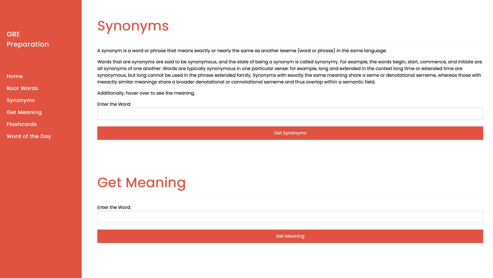

# GRE Preparation Information

### Table of Contents:

1. [Starting Up](#starting_up)

2. [Navigation Pane](#navigation_pane)

3. [Root Words](#rootWords)

4. [Synonyms and Meaning](#synMeaning)

5. [Flash Cards and Word of the Day](#flashWOTD)

<a name="starting_up"/>

#### Starting Up

On clicking the index.html file, the following page appears. The script is embedded in code.js file.

As seen above, the root words are displayed. These words are hard coded in the _code.js_ file, however, there are many other root words in the words.txt file which can be configured in the _index.html_ page.

<a name="navigation_pane"/>

#### Navigation Pane:

The Sidebar let's the user go directly to a certain section of the web page. The first option: _Root Words_, brings the user to the top of the page.

<a name="rootWords"/>

#### Root Words

The root words are configured on the left side. The right side shows derived words which convey the same meaning as the root.

<a name="synMeaning"/>

#### Synonyms and Meaning

The Synonyms feature returns the synonyms of an entered word.

The meanings feature returns the meaning of an entered word.

<a name="flashWOTD"/>

#### Flash Cards and Word of the Day

The Flash card feature is useful for doing a quick revision of words configured in the words.txt file. On hovering over the word, the meaning is displayed. Additionally, the pronounciation can also be heard by clicking the play audio.

Word of the day is a way to highlight one word every day. This will be refreshed on each page refresh.

