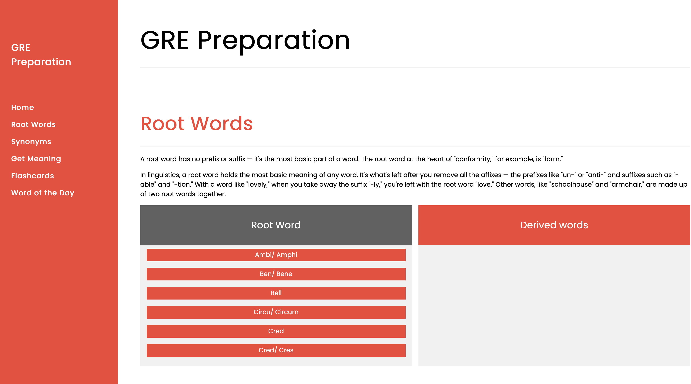
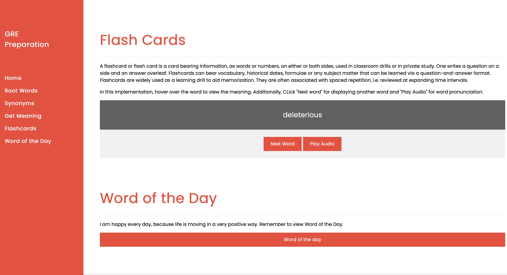

# GRE Preparation Information

### Table of Contents:

1. [Starting Up](#starting_up)

2. [Navigation Pane](#navigation_pane)

3. [Root Words](#rootWords)

4. [Get Synonyms](#rsi)

5. [Get Meaning](#deductions)

6. [Flash Cards](#deductions)

7. [Word of the Day](#deductions)

<a name="starting_up"/>

#### Starting Up

On clicking the index.html file, the following page appears. The script is embedded in code.js file.

As seen above, the root words are displayed. These words are hard coded in the _code.js_ file, however, there are many other root words in the words.txt file which can be configured in the _index.html_ page.

<a name="navigation_pane"/>

#### Navigation Pane:

The Sidebar let's the user go directly to a certain section of the web page. The first option: _Root Words_, brings the user to the top of the page.

<a name="rootWords"/>

#### Root Words

The root words are configured on the left side. The right side shows derived words which convey the same meaning as the root.

In the above diagram, the stock price is clearly rising and the indicator value is going up accordingly.

Further evidence of the stock performance can be seen by visualizing the graph in the "General Stats" section:

Conversely, the stock can be seen as falling when the indicator value is negative. A reversal occurs when the MACD line crosses the signal line as shown below:

The stock of AMD has the following MACD values:

<a name="rsi"/>

#### RSI

The relative strength index (RSI) is a momentum indicator that computes the strength of the stock. It measures the speed and change of price movements. RSI varies from 0 to 100. Typically, a stock is considered to be in overbought position when the RSI value is above 70, while the stock is considered to be in oversold position when the RSI falls below 30.

<a name="deductions"/>

#### Deductions

The deductions section gives an overview based on the technical analysis of MACD and RSI. As per the picture below, the MACD indicator of AMD is pointing to "SELL" while the RSI is balanced at around 40-48.

